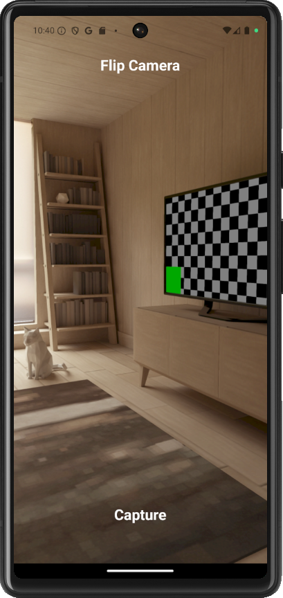
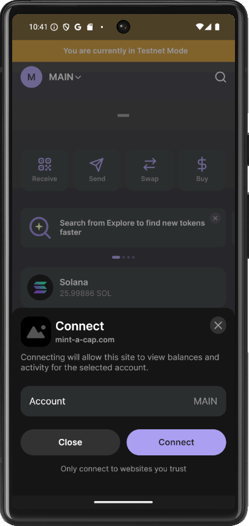
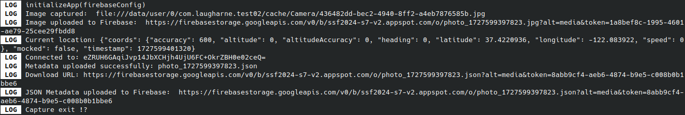

# Solana Mobile Dev


**Exercice:** Build **an app that capture an image through the camera, mint an NFT with that image**, and adds the current location longitude, latitude in the metadata.

Topics in this exercice:
- TypeScript
- React Native
- Expo
- Android
- Firebase
- NFT Mining
- Solana Mobile

## Overview

> This exercise could not be completed due to lack of time, sleep and emulator stability.

As it is, the application runs in emulation.
1. The screenshot is done correctly
2. The captured image is uploaded to Firebase
3. I get the geolocation of the device
4. The application is correctly declared to the Wallet (_Phantom in this case_)
5. A JSON file for the metadata is also uploaded to Firebase


## Installation

https://docs.expo.dev/versions/latest/sdk/camera/
npx expo install expo-camera

Configuration in app.json/app.config.js

--------

## Firebase

- [Add Firebase to your JavaScript project](https://firebase.google.com/docs/web/setup?hl=en#available-libraries)
- [Understand Firebase for Web](https://firebase.google.com/docs/web/learn-more?hl=en#config-object)


```bash
npm install firebase
yarn add expo-image-picker
yarn add firebase@9.6.11
npx expo install expo-file-system
```


```javascript
// Import the functions you need from the SDKs you need
import { initializeApp } from "firebase/app";
import { getAnalytics } from "firebase/analytics";
// TODO: Add SDKs for Firebase products that you want to use
// https://firebase.google.com/docs/web/setup#available-libraries

// Your web app's Firebase configuration
const firebaseConfig = {
  apiKey           : "<FIREBASE_API_KEY>",
  authDomain       : "<FIREBASE_PROJECT_NAME>.firebaseapp.com",
  projectId        : "<FIREBASE_PROJECT_NAME>",
  storageBucket    : "<FIREBASE_PROJECT_NAME>.appspot.com",
  messagingSenderId: "<SENDER_ID>",
  appId            : "<APP_ID>"
};

// Initialize Firebase
const app = initializeApp(firebaseConfig);
```

Add a **firebase.js** file

```javascript
import firebase from 'firebase/compat/app'
import 'firebase/compat/storage'
import { initializeApp } from "firebase/app";

export const firebaseConfig = {
  apiKey           : "KEY",
  authDomain       : "authDomain",
  projectId        : "ProjectID",
  storageBucket    : "storageBucketId",
  messagingSenderId: "sendrId",
  appId            : "appId"
};

if (!firebase.apps.length) {
    firebase.initializeApp(firebaseConfig)
}

const app = initializeApp(firebaseConfig);

export {app, firebase}
```

## Camera image capture

```javascript
import {
  CameraView,
  CameraType,
  useCameraPermissions
} from 'expo-camera';

const [facing, setFacing]             = useState<CameraType>('back');
const [permission, requestPermission] = useCameraPermissions();
const [imageUri, setImageUri]         = useState(null);

const cameraRef = useRef(null); // Ref to the camera

// ...

if (!permission) {
  // Camera permissions are still loading.
  return <View />;
}

if (!permission.granted) {
  // Camera permissions are not granted yet.
  return (
    <View style={styles.container}>
      <Text style={styles.message}>We need your permission to show the camera</Text>
      <Button onPress={requestPermission} title="grant permission" />
    </View>
  );
}

function toggleCameraFacing() {
  setFacing(current => (current === 'back' ? 'front' : 'back'));
}

if (cameraRef.current) {
  const photo = await cameraRef.current.takePictureAsync();
  setImageUri(photo.uri);
  console.log('Image captured: ', photo.uri);
}

// ...

<CameraView style={styles.camera} facing={facing} ref={cameraRef}>
    ...
<CameraView>

```



```bash
 LOG  initializeApp(firebaseConfig)
 LOG  Image captured:  file:///data/user/0/com.laugharne.test02/cache/Camera/436482dd-bec2-4940-8ff2-a4eb7876585b.jpg
```

### Upload image to Firebase

```javascript
import { getStorage, ref, uploadBytes, getDownloadURL } from "firebase/storage";
import {firebase, firebaseConfig} from './firebase'

// ...

firebase.initializeApp(firebaseConfig);

const response        = await fetch(photo.uri);
const blob            = await response.blob();
const storage         = getStorage();
const storageFileName = `photo_${Date.now()}`;
const storageRef      = ref(storage, `${storageFileName}.jpg`);
await uploadBytes(storageRef, blob);

const downloadURL = await getDownloadURL(storageRef);
console.log('Image uploaded to Firebase: ', downloadURL);

```
```bash
 LOG  initializeApp(firebaseConfig)
 LOG  Image captured:  file:///data/user/0/com.laugharne.test02/cache/Camera/436482dd-bec2-4940-8ff2-a4eb7876585b.jpg
 LOG  Image uploaded to Firebase:  https://firebasestorage.googleapis.com/v0/b/ssf2024-s7-v2.appspot.com/o/photo_1727599397823.jpg?alt=media&token=1a8bef8c-1995-4601-ae79-25cee29fbdd8
```

## Geolocation

- [Location - Expo Documentation](https://docs.expo.dev/versions/latest/sdk/location/)
- [How to use Geolocation, Geocoding and Reverse Geocoding in React Native Apps](https://enappd.com/blog/geolocation-geocoding-react-native-apps/84/)

```bash
npx expo install expo-location
```

```typescript
import * as Location from 'expo-location';

async function getCurrentLocation() {
  let { status } = await Location.requestForegroundPermissionsAsync();
  if (status !== 'granted') {
    console.error('Permission to access location was denied');
    return null;
  }

  let location = await Location.getCurrentPositionAsync({});
  return location;
}
```

```bash
 LOG  Current location: {"coords": {"accuracy": 600, "altitude": 0, "altitudeAccuracy": 0, "heading": 0, "latitude": 37.4220936, "longitude": -122.083922, "speed": 0}, "mocked": false, "timestamp": 1727599401320}
```

## Connecting to wallet

```typescript
import {transact, Web3MobileWallet} from '@solana-mobile/mobile-wallet-adapter-protocol-web3js';

// ...

export const APP_IDENTITY = {
  name: "Mint A Cap'",
  uri:  'https://mint-a-cap.com',
  icon: "favicon.ico", // Full path resolves to https://yourdapp.com/favicon.ico
};

// ...

const authorizationResult = await transact(async (wallet: Web3MobileWallet) => {
    const authorizationResult = await wallet.authorize({
    cluster : 'devnet',
    identity: APP_IDENTITY,
  });

  console.log("Connected to: " + authorizationResult.accounts[0].address);

  return authorizationResult;
});


console.log("Connected to: " + authorizationResult.accounts[0].address)
```

```bash
 LOG  Connected to: eZRUH6GAqiJvp14JbXCHjh4UjU6FC+OkrZBH0e02ceQ=
```



## Full logs

```bash
 LOG  initializeApp(firebaseConfig)
 LOG  Image captured:  file:///data/user/0/com.laugharne.test02/cache/Camera/436482dd-bec2-4940-8ff2-a4eb7876585b.jpg
 LOG  Image uploaded to Firebase:  https://firebasestorage.googleapis.com/v0/b/ssf2024-s7-v2.appspot.com/o/photo_1727599397823.jpg?alt=media&token=1a8bef8c-1995-4601-ae79-25cee29fbdd8
 LOG  Current location: {"coords": {"accuracy": 600, "altitude": 0, "altitudeAccuracy": 0, "heading": 0, "latitude": 37.4220936, "longitude": -122.083922, "speed": 0}, "mocked": false, "timestamp": 1727599401320}
 LOG  Connected to: eZRUH6GAqiJvp14JbXCHjh4UjU6FC+OkrZBH0e02ceQ=
 LOG  Metadata uploaded successfully: photo_1727599397823.json
 LOG  Download URL: https://firebasestorage.googleapis.com/v0/b/ssf2024-s7-v2.appspot.com/o/photo_1727599397823.json?alt=media&token=8abb9cf4-aeb6-4874-b9e5-c008b0b1bbe6
 LOG  JSON Metadata uploaded to Firebase:  https://firebasestorage.googleapis.com/v0/b/ssf2024-s7-v2.appspot.com/o/photo_1727599397823.json?alt=media&token=8abb9cf4-aeb6-4874-b9e5-c008b0b1bbe6
 LOG  Capture exit !?
```




--------

Try to resolve problem "Error: Can't resolve 'crypto'"

- [javascript - Module not found: Error: Can't resolve 'crypto' - Stack Overflow](https://stackoverflow.com/questions/54162297/module-not-found-error-cant-resolve-crypto)

`npm install crypto-js@3.1.9-1`


--------


## Resources

- [Solana Mobile Stack Overview](https://docs.solanamobile.com/getting-started/overview)
- [Exploring Mobile Wallet Adapter | Solana](https://solana.com/developers/courses/mobile/mwa-deep-dive)
- [GitHub - solana-mobile/mobile-wallet-adapter](https://github.com/solana-mobile/mobile-wallet-adapter)
- [#s7 - solana mobile dev](https://pitch.com/v/s7---solana-mobile-dev-as8rug)

**React Native & camera:**
- [How to pick images from Camera & Gallery in React Native app](https://medium.com/enappd/how-to-pick-images-from-camera-gallery-in-react-native-app-54d8d362de1e)
- [GitHub - enappd/rn-imagepicker: How to pick images from Camera & Gallery in React Native app - Enappd](https://github.com/enappd/rn-imagepicker)
- [GitHub - react-native-image-picker/react-native-image-picker: :sunrise_over_mountains: A React Native module that allows you to use native UI to select media from the device library or directly from the camera.](https://github.com/react-native-image-picker/react-native-image-picker)
- [How to Captured And then save those images in react native app it self - Stack Overflow](https://stackoverflow.com/questions/66009837/how-to-captured-and-then-save-those-images-in-react-native-app-it-self)
- [Camera - Expo Documentation](https://docs.expo.dev/versions/latest/sdk/camera/)

**Expo:**
- [Expo](https://expo.dev/)
- [Expo Documentation](https://docs.expo.dev/)
- [Utiliser la caméra - appareil photo via Expo (React Native) - Web-Wave - Web-Wave](https://www.web-wave.fr/utiliser-la-camera-appareil-photo-via-expo-react-native/)

**Geolocation:**
- [How to use Geolocation, Geocoding and Reverse Geocoding in React Native Apps](https://enappd.com/blog/geolocation-geocoding-react-native-apps/84/)

**Firebase:**
- [Uploading Images to Firebase Storage in React Native with Expo Workflow. - DEV Community](https://dev.to/adii9/uploading-images-to-firebase-storage-in-react-native-with-expo-workflow-24kj)
- [GitHub - adii9/Image-Upload-to-Firebase](https://github.com/adii9/Image-Upload-to-Firebase)

**NFT.storage:**
- [Future-proof every NFT](https://nft.storage/)
- [NFT.Storage - Documentation](https://app.nft.storage/v1/docs/intro)
- [NFT.Storage - Documentation](https://app.nft.storage/v1/docs/client/http-api)

**IPFS:**
- [An open system to manage data without a central server | IPFS](https://ipfs.tech/)
- [Decentralized hosting of a static react app with IPFS](https://medium.com/elbstack/decentralized-hosting-of-a-static-react-app-with-ipfs-aae11b860f5e)

**Wallet:**
- [Using Mobile Wallet Adapter](https://docs.solanamobile.com/react-native/using_mobile_wallet_adapter)

**NFT Minting:**
- [Mobile NFT Minter Tutorial](https://docs.solanamobile.com/react-native/mobile_nft_minter_tutorial)
- [tutorial-apps/MobileNFTMinter at main · solana-mobile/tutorial-apps · GitHub](https://github.com/solana-mobile/tutorial-apps/tree/main/MobileNFTMinter)
- [How to mint NFTs using Solana’s mobile wallet adapter](https://monadical.com/posts/minting-nft-solana-mobile.html#)
- [How to Create a NFT On Solana | Token Metadata Guides](https://developers.metaplex.com/token-metadata/guides/javascript/create-an-nft)